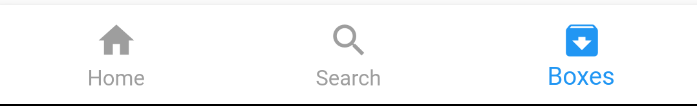

# Adaptive Scrollable TabsView

Adaptive Scrollable Tab Bar is an upgraded version of Bottom Navigation Bar
It supports scrolling between tabs and animation on transition between tabs also the bottom navigation bar will adapt with the device so if it's android it will bring the android style and if it is an IOS device it will automatically change the style to cupertino style

## How to use

After installing the package and including it to your project you will now need a `MaterialApp` Widget to put this widget on it

the main widget in the widget tree is a `Scaffold` widget so you can add your `appBar` inside this widget and don't add the `appBar` outside
(`appBar` is not necessary)

The `AdaptiveScrollableTabsView` Has **2 required arguments**  
    **-Items**
    # AdaptiveScrollableTabsView

Adaptive Scrollable Tab Bar is an upgraded version of Bottom Navigation Bar
It supports scrolling between tabs and animation on transition between tabs also the bottom navigation bar will adapt with the device so if it's android it will bring the android style and if it is an IOS device it will automatically change the style to cupertino style

## How to use

After installing the package and including it to your project you will now need a `MaterialApp` Widget to put this widget on it

the main widget in the widget tree is a `Scaffold` widget so you can add your `appBar` inside this widget and don't add the `appBar` outside
(`appBar` is not necessary)

### Required Arguments
The `AdaptiveScrollableTabsView` Has **2 required arguments:**

#### `Items`
They Are `List<BottomNavigationBarItem>`

Items are the bottom buttons that will refer to the tabs

#### `Pages`
They Are `List<Widget>`

Pages are widgets which will be the page that will be displayed in the tab

### Optional Arguments

#### `startTab`
Type : `int`

Objective : choose which tab do you want to start with ( Default Tab )

#### `appBar`
Type : `PreferredSizeWidget`

Objective : Insert App Bar to your page

#### `currentPage`
Type : `int`

Objective : refers to the currently selected tab

#### `selectedColor`
Type : `Color`

Objective : refers to the active item's Label and Icon color

#### `unselectedColor`
Type : `Color`

Objective : refers to inactive items Label and Icon color

#### `backgroundColor`
Type : `Color`

Objective : refers to the background color

#### `animationCurve`
Type : `Curve`

Objective : refers to the curve of transition animation

#### `animationDurationForTab`
Type : `Duration`

Objective : refers to animation transition duration when user tabs on item of the bottom tab bar

#### `animationDurationForScroll`
Type : `Duration`

Objective : refers to animation transition duration when user scroll between pages

#### `elevation`
Type : `double`

Objective : elevation of `BottomNavigationBar`

#### `iconSize`
Type : `int`

Objective : icon size of items

#### `selectedFontSize`
Type : `int`

Objective : font size of the active item

#### `unselectedFontSize`
Type : `int`

Objective : font size of inactive items

#### `selectedLabelStyle`
Type : `TextStyle`

Objective : text style of the active item

#### `unselectedLabelStyle`
Type : `TextStyle`

Objective : text style of inactive items

#### `showSelectedLabels`
Type : `Boolean`

Objective : Choose either you want to show the selected item label or just show the icon

#### `showUnselectedLabels`
Type : `Boolean`

Objective : Choose either you want to show the unselected items label or just show their icon

#### `allowScroll`
Type : `Boolean`

Objective : Enable or Disable Tabs Scrolling

#### `onTap`
Type : `Function(int)`

Objective : The Widget Passes current tab to `onTap(int)` as a parameter so you can know which page is selected now